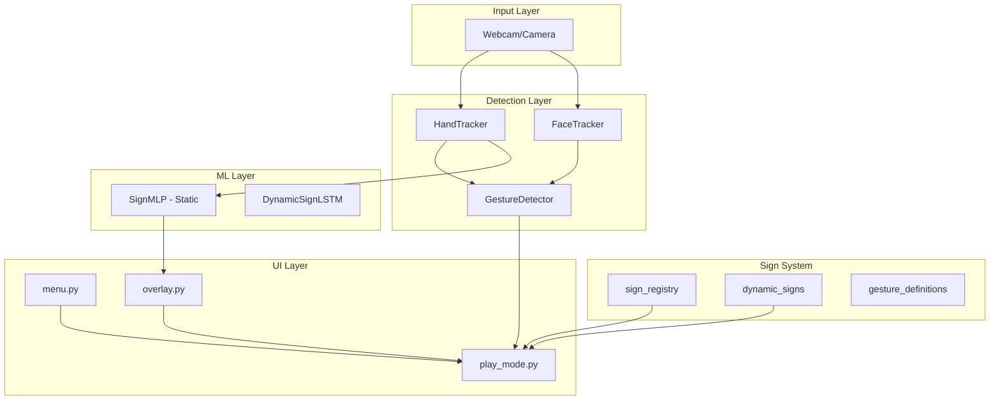

# SignSense - Codebase Reference

## Project Overview

SignSense is an ASL (American Sign Language) learning application that uses Google's MediaPipe for real-time hand landmark detection to teach basic and entry-level ASL signs. The project combines computer vision, machine learning, and a gamified UI to help users learn ASL letters and gestures.

### Purpose
- Real-time hand tracking using MediaPipe
- ASL letter recognition (A-Z)
- Gesture detection for common signs (HELLO, THANK YOU, NAME, GOOD, HELP, WATER, YES, NO, BAD)
- Stage-by-stage sign learning mode
- Dynamic sign motion recording and training

### Target Users
- Beginners learning ASL
- Educators teaching ASL
- Anyone interested in sign language recognition

---

## Architecture Overview



### Application State Machine

The main application (`main.py`) follows this state flow:

```
MAIN_MENU → [Play] → LEVEL_SELECT → [letters] → PLAY
          → [Debug] → DEBUG
          → [Quit]/ESC → exit
```

States:
- **MAIN_MENU**: Camera OFF, show main menu
- **LEVEL_SELECT**: Camera OFF, show level selection  
- **PLAY**: Camera ON, stage-by-stage sign learning
- **DEBUG**: Camera ON, raw classifier output with score bars

---

## Technology Stack

### Dependencies

```
# Python 3.9-3.12 required (MediaPipe does not support 3.14+)
mediapipe>=0.10.31
opencv-python>=4.8.0
numpy>=1.24.0
torch>=2.0.0
pillow>=9.0.0
pandas>=1.5.0
matplotlib>=3.7.0
scikit-learn>=1.2.0
pyyaml>=6.0
```

### Frameworks & Libraries

| Category | Library | Purpose |
|----------|---------|---------|
| Computer Vision | MediaPipe | Hand/Face landmark detection |
| Image Processing | OpenCV | Frame capture and rendering |
| Machine Learning | PyTorch | Neural network models |
| Data Processing | NumPy, Pandas | Array operations, data loading |
| Visualization | Matplotlib | Training curve plotting |
| UI | OpenCV drawing | All UI rendering (no GUI framework) |

---

## Directory Structure

```
SignSense/
├── signsense/                    # Main package
│   ├── __init__.py
│   ├── main.py                   # Application entry point
│   ├── assets/
│   │   ├── models/               # MediaPipe model files
│   │   │   ├── hand_landmarker.task
│   │   │   └── face_landmarker.task
│   │   └── signs/                # Sign preview images
│   │       └── Z/view_1.png
│   ├── config/
│   │   ├── dynamic_config.py     # Dynamic sign configuration loader
│   │   ├── dynamic_signs.csv     # CSV registry for dynamic signs
│   │   └── dynamic_signs.yaml    # YAML config for dynamic signs
│   ├── detector/
│   │   ├── hand_tracker.py       # MediaPipe hand tracking wrapper
│   │   ├── face_tracker.py       # MediaPipe face tracking wrapper
│   │   ├── gesture_detector.py   # Gesture detection pipeline
│   │   └── asl_classifier_letters.py
│   ├── ml/
│   │   ├── model.py              # SignMLP architecture
│   │   ├── train.py              # Static sign training script
│   │   ├── dynamic_model.py      # DynamicSignLSTM architecture
│   │   ├── dynamic_train.py      # Dynamic sign training script
│   │   ├── dynamic_recorder.py   # Data recording tool
│   │   ├── record_landmarks.py   # Landmark recording utility
│   │   ├── config/
│   │   │   ├── config_loader.py  # Unified config loader
│   │   │   └── training.yaml     # Training configuration
│   │   ├── utils/
│   │   │   ├── checkpoint.py
│   │   │   ├── metrics.py
│   │   │   └── experiment_tracker.py
│   │   └── trainers/
│   │       └── base_trainer.py
│   ├── signs/
│   │   ├── sign_registry.py      # Central sign registry
│   │   ├── dynamic_signs.py      # Dynamic sign detectors (J, Z)
│   │   ├── gesture_definitions.py # Gesture class definitions
│   │   ├── dynamic_sign_factory.py
│   │   └── trainable_dynamic_signs.py
│   ├── ui/
│   │   ├── menu.py               # OpenCV menu rendering
│   │   ├── overlay.py            # Landmark overlay, score bars
│   │   └── play_mode.py          # Game/play mode UI
│   └── utils/
│       ├── logger.py             # Centralized logging
│       └── smoothing.py          # Prediction smoothing
├── ml/
│   ├── data/
│   │   ├── landmarks.csv         # Static landmark training data
│   │   ├── dynamic/              # Dynamic gesture data
│   │   │   ├── J/                # J sign sequences
│   │   │   └── Z/                # Z sign sequences
│   │   └── backups/              # Data backups
│   └── models/                   # Trained model checkpoints
│       ├── sign_mlp.pt            # Static MLP model
│       ├── dynamic_J.pt           # J sign LSTM model
│       └── dynamic_Z.pt           # Z sign LSTM model
├── docs/
│   ├── README.md
│   ├── DYNAMIC_GESTURE_TRAINING_GUIDE.md
│   ├── DYNAMIC_RECORDER_GUIDE.md
│   ├── MODEL_GUIDE.md
│   └── QUICK_REFERENCE.md
├── requirements.txt
├── .gitignore
└── old_play_model.txt            # Legacy reference
```

---

## Core Components

### 1. Detection Layer

#### HandTracker (`detector/hand_tracker.py`)
- Wraps MediaPipe Tasks Hand Landmarker
- Returns 21 hand landmarks with x, y, z coordinates
- Configurable detection/tracking confidence
- Handles model download on first run

```python
from detector.hand_tracker import HandTracker

tracker = HandTracker(min_detection_confidence=0.6, min_tracking_confidence=0.6)
result = tracker.process_frame(frame)
# result = {"landmarks": [...], "handedness": "Right", "confidence": 0.6}
```

#### FaceTracker (`detector/face_tracker.py`)
- MediaPipe Face Landmarker wrapper
- Extracts nose tip and chin for spatial reference
- Used for YES/NO head gesture detection

#### GestureDetector (`detector/gesture_detector.py`)
- Multi-stage detection pipeline
- Supports one-handed, two-handed, and facial gestures
- Hand shape detection using finger positions
- Movement pattern detection from position history

### 2. ML Layer

#### SignMLP (`ml/model.py`)
- MLP architecture for static ASL letter classification
- Input: 63 normalized landmarks (21 × 3)
- Architecture: Linear(63→256) → BatchNorm → ReLU → Dropout(0.3)
              → Linear(256→128) → BatchNorm → ReLU → Dropout(0.2)
              → Linear(128→64) → BatchNorm → ReLU
              → Linear(64→num_classes)

#### LandmarkNormalizer
- Translates landmarks so wrist (lm[0]) is at origin
- Scales by wrist→middle-MCP distance for camera-distance-invariance
- Outputs 63-feature vector

#### DynamicSignLSTM (`ml/dynamic_model.py`)
- LSTM for multi-stage dynamic sign recognition
- Two output heads: stage classifier and transition detector
- Input: Variable-length sequences of landmarks

### 3. Sign System

#### Sign Registry (`signs/sign_registry.py`)
- Single source of truth for all signs
- SignType enum: STATIC (single-frame) or DYNAMIC (motion)
- CSV integration for dynamic sign enable/disable

```python
from signs.sign_registry import SIGN_REGISTRY, SignType, get_sign

# Get all signs
for entry in SIGN_REGISTRY:
    print(f"{entry.letter}: {entry.sign_type}")

# Check sign type
j_sign = get_sign("J")
print(j_sign.sign_type)  # SignType.DYNAMIC
```

#### Dynamic Sign Detectors (`signs/dynamic_signs.py`)
- **JDetector**: 3-phase detector for ASL "J"
  - Phase 0: Hold I shape (pinky up)
  - Phase 1: Hook pinky DOWN
  - Phase 2: Palm away + hold I
- **ZDetector**: Waypoint-based detector for ASL "Z"
  - Tracks diagonal + horizontal strokes

#### Gesture Definitions (`signs/gesture_definitions.py`)
- Defines 9 ASL gestures: HELLO, THANK YOU, NAME, GOOD, HELP, WATER, YES, NO, BAD
- Each GestureClass specifies: hand shape, movement pattern, target body region

### 4. UI Layer

#### Menu (`ui/menu.py`)
- Pure OpenCV rendering (no camera required)
- Dark tech/arcade aesthetic
- Supports MAIN_MENU, LEVEL_SELECT, RECORD_MENU, DEBUG_MENU

#### Overlay (`ui/overlay.py`)
- Renders hand landmarks on camera feed
- Score bars for letter confidence
- SignHoldTimer for confirmation stability

#### Play Mode (`ui/play_mode.py`)
- Stage-by-stage learning UI
- Preview box for sign reference images
- Progress tracking per stage
- Supports both letter-based and gesture-based signs

### 5. Utility Modules

#### Logger (`utils/logger.py`)
- Centralized logging with file + console handlers
- Colored output for terminal
- Performance tracking with `TimingContext` and `PerformanceTracker`
- Session start/end logging

#### PredictionSmoother (`utils/smoothing.py`)
- Sliding buffer for prediction stability
- Confirms letter only when same result appears N times

#### Config Loader (`ml/config/config_loader.py`)
- Type-safe YAML configuration
- Singleton pattern for config management
- CLI argument overrides support
- Dynamic sign config integration

---

## Configuration System

### Dynamic Signs Config (`config/dynamic_signs.yaml`)

```yaml
dynamic_signs:
  J:
    type: "complex"
    description: "Letter J in ASL"
    detector:
      i_hold_frames: 6
      down_threshold: 0.06
      finish_hold_frames: 8
      phase_timeout: 70
    training:
      sequence_length: 120
      batch_size: 8
      epochs: 50
      learning_rate: 0.001
      hidden_size: 128
    stages:
      0: "Step 1/3 — Hold I (pinky up)"
      1: "Step 2/3 — Hook pinky DOWN"
      2: "Step 3/3 — Palm away, hold I"

  Z:
    type: "complex"
    # ... similar structure
```

### Training Config (`ml/config/training.yaml`)

- **Defaults**: random_seed, device (cpu/cuda/auto), precision
- **Data**: Static and dynamic data paths, train/val splits
- **Models**: static_mlp and dynamic_lstm configurations
- **Training**: epochs, batch_size, learning_rate, early_stopping
- **Augmentation**: noise_std, x_flip_prob, scale_range

---

## Development Setup

### Prerequisites
- Python 3.9-3.12 (not 3.14+)
- Webcam for camera-based features
- ~4GB free disk space for models and data

### Installation

```bash
# Clone or navigate to project
cd SignSense

# Create virtual environment (recommended)
python -m venv .venv
.venv\Scripts\activate  # Windows

# Install dependencies
pip install -r requirements.txt
```

### Running the Application

```bash
# Main application
python -m signsense.main
# or
python signsense/main.py
```

### Training Models

```bash
# Static sign training
python -m ml.train --data ml/data/landmarks.csv --epochs 100 --lr 0.001

# Dynamic sign training
python -m ml.dynamic_train J
python -m ml.dynamic_train Z

# Dynamic gesture recording
python -m ml.dynamic_recorder
```

---

## Coding Conventions

### File Organization
- One primary class per file (with helper utilities)
- Private methods prefixed with `_`
- Type hints used for public APIs
- Docstrings for all public classes and functions

### Import Style
```python
# Package-relative imports within signsense
from detector.hand_tracker import HandTracker
from signs.sign_registry import SignType

# Absolute imports from ml modules
from signsense.ml.model import SignMLP
```

### Naming Conventions
- Classes: `PascalCase` (e.g., `HandTracker`, `SignMLP`)
- Functions/methods: `snake_case` (e.g., `process_frame`, `_detect_hand_shape`)
- Constants: `UPPER_SNAKE_CASE` (e.g., `DEFAULT_CONFIDENCE_THRESHOLD`)
- Private members: leading underscore (e.g., `_config`, `_phase`)

### Error Handling
- Use exceptions for truly exceptional conditions
- Log errors with context using `logger.error()`
- Provide meaningful error messages

### State Management
- Sign registry uses singleton pattern for config
- Detector cache for model reuse in main.py
- Application state machine in main.py

---

## API Reference

### Hand Tracking API

```python
# Initialization
tracker = HandTracker(
    min_detection_confidence=0.6,
    min_tracking_confidence=0.6,
    max_num_hands=1
)

# Processing
result = tracker.process_frame(frame)
# Returns: {"landmarks": [...], "handedness": "Right", "confidence": 0.6} or None
```

### Model Loading API

```python
from ml.model import load_model, SignMLP

model, normalizer, label_map, inv_label_map = load_model(
    "ml/models/sign_mlp.pt",
    device="cpu"
)

# Inference
features = normalizer.normalise(landmarks)
tensor = torch.tensor(features).unsqueeze(0)
logits = model(tensor)
prediction = logits.argmax(dim=1).item()
letter = inv_label_map[prediction]
```

### Dynamic Sign Detection API

```python
from signs.dynamic_signs import get_detector

detector = get_detector("J")
# or
detector = get_detector("Z")

# Per-frame update
complete = detector.update(landmarks, handedness)
# Returns True when sign is complete
stage_label = detector.stage_label
```

### Gesture Detection API

```python
from detector.gesture_detector import GestureDetector

detector = GestureDetector(
    hand_tracker=hand_tracker,
    face_tracker=face_tracker,
    confidence_threshold=0.7
)

# Update with new frame
detector.update(frame)

# Detect gesture
result = detector.detect()
# result = DetectionResult(
#   sign_name="HELLO",
#   confidence=0.85,
#   hand_shape="5",
#   movement="touch_forehead_move_out",
#   is_gesture=True
# )
```

---

## Testing & Validation

### Training Success Criteria

| Metric | Target | Acceptable |
|--------|--------|------------|
| Validation Accuracy | >90% | >80% |
| Loss | <0.3 | <0.5 |
| Overfitting Gap | <10% | <15% |

### Data Requirements

| Gesture Type | Minimum Samples | Recommended Samples |
|--------------|-----------------|---------------------|
| Static Letters | 450+ per letter | 500+ per letter |
| Dynamic (Complex) | 15 | 20-30 |
| Dynamic (Simple) | 10 | 15-20 |

### Sample File Naming

```
ml/data/dynamic/<GESTURE>/
├── metadata.json
├── <GESTURE>_s0_0.npy    # Stage 0, sequence 0
├── <GESTURE>_s0_1.npy    # Stage 0, sequence 1
├── <GESTURE>_s1_0.npy    # Stage 1, sequence 0
└── ...
```

Each `.npy` file: shape `(num_frames, 63)` - float32

---

## Troubleshooting

### Common Issues

1. **Python version error**
   - SignSense requires Python 3.9-3.12
   - Error: "SignSense requires Python 3.9–3.12"

2. **Camera not available**
   - Check camera index: try `cv2.VideoCapture(0)` through `cv2.VideoCapture(2)`
   - Adjust in `main.py` if needed

3. **MediaPipe model download fails**
   - Models auto-download on first run
   - Check internet connection
   - Models stored in `signsense/assets/models/`

4. **Low detection accuracy**
   - Ensure good lighting on hands
   - Keep hand centered in camera
   - Record more training data

5. **Training runs out of memory**
   - Reduce batch_size in config
   - Use CPU if no GPU available

---

## Logging

Logs are written to:
- Console (INFO level with colors)
- File: `logs/signsense_<timestamp>.log` (DEBUG level)

```python
from utils.logger import logger, TimingContext

# Simple logging
logger.info("Processing frame")

# Timing context
with TimingContext("Model inference"):
    result = model(input)
```

---

## Key Files Reference

| File | Purpose |
|------|---------|
| `signsense/main.py` | Application entry point, state machine |
| `signsense/detector/hand_tracker.py` | MediaPipe hand tracking |
| `signsense/detector/gesture_detector.py` | Gesture detection pipeline |
| `signsense/ml/model.py` | SignMLP architecture |
| `signsense/ml/train.py` | Static sign training script |
| `signsense/ml/dynamic_model.py` | DynamicSignLSTM architecture |
| `signsense/ml/dynamic_train.py` | Dynamic sign training script |
| `signsense/signs/sign_registry.py` | Central sign registry |
| `signsense/signs/dynamic_signs.py` | Dynamic sign detectors |
| `signsense/signs/gesture_definitions.py` | Gesture class definitions |
| `signsense/ui/play_mode.py` | Play mode UI |
| `signsense/config/dynamic_config.py` | Config loader |
| `signsense/config/dynamic_signs.yaml` | Dynamic sign parameters |
| `signsense/ml/config/training.yaml` | Training config |

---

## Contributing

When adding new signs:

1. **Static Signs**: Add to `sign_registry.py` SIGN_REGISTRY
2. **Dynamic Signs**: 
   - Add config to `dynamic_signs.yaml`
   - Implement detector in `dynamic_signs.py`
   - Add preview images to `ASL_Alphabet/<LETTER>/`

3. **Gestures**: Add to `gesture_definitions.py`

---

## Environment Variables

No special environment variables required. All configuration is file-based.

---

## External Integrations

- **MediaPipe Models**: Downloaded from Google servers on first run
  - Hand Landmarker: `hand_landmarker.task`
  - Face Landmarker: `face_landmarker.task`
- **No external APIs** required
- **No cloud services** used

---

*Last updated: 2026-03-27*
