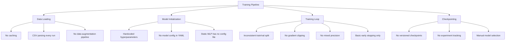

# SignSense Training Pipeline Optimization Plan

## Executive Summary

This document provides a comprehensive analysis of the current SignSense model training process and presents actionable recommendations for improving code structure, hyperparameter management, logging, error handling, and experiment tracking. The goal is to create a more efficient, modular, and developer-friendly training pipeline.

---

## 1. Current State Analysis

### 1.1 Files Examined

| File | Purpose | Issues Identified |
|------|---------|-------------------|
| [`signsense/ml/train.py`](signsense/ml/train.py) | Static MLP training | Limited config, hardcoded values |
| [`signsense/ml/dynamic_train.py`](signsense/ml/dynamic_train.py) | Dynamic LSTM training | Duplicated logic, inconsistent with train.py |
| [`signsense/ml/model.py`](signsense/ml/model.py) | MLP architecture | No configuration for architecture |
| [`signsense/ml/dynamic_model.py`](signsense/ml/dynamic_model.py) | LSTM architecture | Mixed with normalizer |
| [`signsense/config/dynamic_config.py`](signsense/config/dynamic_config.py) | Configuration management | Singleton pattern, partial coverage |
| [`signsense/utils/logger.py`](signsense/utils/logger.py) | Logging infrastructure | Good foundation, not integrated with training |
| [`signsense/ml/record_landmarks.py`](signsense/ml/record_landmarks.py) | Static data recording | No integration with training |
| [`signsense/ml/dynamic_recorder.py`](signsense/ml/dynamic_recorder.py) | Dynamic data recording | No integration with training |

### 1.2 Identified Bottlenecks & Issues



---

## 2. Code Structure & Modularity Issues

### 2.1 Duplicated Code

**Issue:** Both [`train.py`](signsense/ml/train.py) and [`dynamic_train.py`](signsense/ml/dynamic_train.py) contain identical or very similar code blocks:

1. Data loading and preprocessing
2. Train/validation split logic
3. Training loop structure
4. Evaluation metrics
5. Checkpoint saving

**Recommendation:** Create a unified training framework:

```
signsense/ml/
├── base/
│   ├── base_trainer.py      # Abstract base class
│   ├── base_dataset.py      # Common dataset utilities
│   └── base_model.py        # Model loading/saving utilities
├── trainers/
│   ├── mlp_trainer.py       # Static sign trainer
│   └── lstm_trainer.py      # Dynamic sign trainer
├── datasets/
│   ├── landmark_dataset.py  # Static dataset
│   └── sequence_dataset.py   # Dynamic dataset
└── config/
    ├── training_config.py   # Unified config
    └── model_config.yaml    # All model configs
```

### 2.2 Configuration Fragmentation

**Current State:**
- Static signs: No config file, hardcoded in [`train.py`](signsense/ml/train.py:143-148)
- Dynamic signs: YAML config in [`dynamic_signs.yaml`](signsense/config/dynamic_signs.yaml)

**Recommendation:** Unified configuration system:

```yaml
# ml/config/training.yaml
models:
  static_mlp:
    architecture:
      layers: [256, 128, 64]
      dropout: [0.3, 0.2, 0.0]
      activation: "relu"
      batch_norm: true
    training:
      epochs: 100
      batch_size: 64
      learning_rate: 0.001
      weight_decay: 0.0001
      label_smoothing: 0.1
      optimizer: "adamw"
      scheduler: "cosine_annealing"
      early_stopping:
        patience: 15
        min_delta: 0.001

  dynamic_lstm:
    architecture:
      input_size: 63
      hidden_size: 128
      num_layers: 2
      dropout: 0.3
      bidirectional: false
    training:
      epochs: 50
      batch_size: 8
      learning_rate: 0.001
      # ... etc
```

### 2.3 Mixed Responsibilities

**Issue:** [`dynamic_model.py`](signsense/ml/dynamic_model.py) contains both model architecture AND normalization logic.

**Recommendation:** Separate concerns:
- `models/lstm.py` - Model architecture only
- `preprocessing/normalizer.py` - Standalone normalizer classes

---

## 3. Hyperparameter Management

### 3.1 Current Gaps

| Aspect | Static Signs | Dynamic Signs |
|--------|--------------|---------------|
| Architecture params | Hardcoded | Partial YAML |
| Training params | CLI args only | YAML + CLI |
| Data augmentation | Hardcoded values | N/A |
| Regularization | Hardcoded | Hardcoded |
| Optimizer config | CLI only | YAML |
| Scheduler config | CLI only | YAML |

### 3.2 Recommendations

1. **Centralize all hyperparameters** in YAML configuration
2. **Add CLI override capability** for quick experiments:
   ```bash
   python -m ml.train --config ml/config/training.yaml --epochs 200 --lr 0.0005
   ```
3. **Create hyperparameter search space** definition for future AutoML:
   ```yaml
   search_space:
     learning_rate: [0.0001, 0.0005, 0.001, 0.005]
     batch_size: [16, 32, 64, 128]
     hidden_size: [64, 128, 256]
   ```
4. **Add model variant support** in config:
   ```yaml
   variants:
     lightweight:
       hidden_size: 64
       dropout: 0.4
     standard:
       hidden_size: 128
       dropout: 0.3
     large:
       hidden_size: 256
       dropout: 0.2
   ```

---

## 4. Logging & Monitoring

### 4.1 Current State

The project has a solid logging foundation in [`logger.py`](signsense/utils/logger.py) but it's **not integrated** with training scripts.

**Current issues:**
- Training uses `print()` statements exclusively
- No structured logging to files during training
- No metrics history persistence
- No integration with ML experiment tracking tools
- No training progress visualization in real-time

### 4.2 Recommendations

#### 4.2.1 Integrate with Existing Logger

```python
# Use the existing logger in training scripts
from signsense.utils.logger import logger, TimingContext

def train_one_epoch(model, train_loader, ...):
    with TimingContext("train_one_epoch"):
        # training code
        logger.debug(f"Batch loss: {loss.item()}")
```

#### 4.2.2 Add Structured Metrics Logging

```python
# Create a TrainingMetrics class
class TrainingMetrics:
    def __init__(self, log_dir: Path):
        self.log_dir = log_dir
        self.metrics = {
            "epoch": [],
            "train_loss": [],
            "val_loss": [],
            "val_acc": [],
            "learning_rate": [],
            "epoch_time": []
        }
    
    def log_epoch(self, epoch, train_loss, val_loss, val_acc, lr, time):
        self.metrics["epoch"].append(epoch)
        self.metrics["train_loss"].append(train_loss)
        self.metrics["val_loss"].append(val_loss)
        self.metrics["val_acc"].append(val_acc)
        self.metrics["learning_rate"].append(lr)
        self.metrics["epoch_time"].append(time)
        
        # Log to file
        self._save_metrics()
        
        # Log to logger
        logger.info(
            f"Epoch {epoch} | "
            f"train_loss: {train_loss:.4f} | "
            f"val_loss: {val_loss:.4f} | "
            f"val_acc: {val_acc:.4f} | "
            f"lr: {lr:.6f} | "
            f"time: {time:.2f}s"
        )
```

#### 4.2.3 Add TensorBoard/MLflow Support

```python
# Add to requirements.txt
# tensorboard>=2.12.0
# mlflow>=2.0.0

from torch.utils.tensorboard import SummaryWriter

class TensorBoardLogger:
    def __init__(self, log_dir: Path):
        self.writer = SummaryWriter(log_dir)
    
    def log_metrics(self, metrics: dict, step: int):
        for key, value in metrics.items():
            self.writer.add_scalar(key, value, step)
    
    def log_histogram(self, tag, values, step):
        self.writer.add_histogram(tag, values, step)
```

### 4.3 Real-Time Progress Display

Add a progress bar with rich metrics:

```python
from rich.console import Console
from rich.progress import Progress, SpinnerColumn, TextColumn, BarColumn, MetricColumn

console = Console()

with Progress(
    SpinnerColumn(),
    TextColumn("[progress.description]{task.description}"),
    BarColumn(),
    MetricColumn(),
    TextColumn("[progress.percentage]{task.percentage:>3.0f}%"),
    console=console
) as progress:
    task = progress.add_task("Training", total=epochs)
    for epoch in range(epochs):
        # training...
        progress.update(task, advance=1, train_loss=train_loss, val_acc=val_acc)
```

---

## 5. Error Handling & Debugging

### 5.1 Current Gaps

1. **No input validation** - Model crashes on bad data
2. **No graceful degradation** - Single error stops training
3. **Limited error messages** - Hard to debug issues
4. **No data validation** - Training proceeds with corrupted data
5. **No checkpoint recovery** - Lost progress on crash

### 5.2 Recommendations

#### 5.2.1 Add Data Validation

```python
class LandmarkDataset(Dataset):
    def __init__(self, X, y, augment=False):
        # Validate data shapes
        if X.shape[1] != 63:
            raise ValueError(f"Expected 63 features, got {X.shape[1]}")
        
        # Check for NaN/Inf
        if np.any(np.isnan(X)) or np.any(np.isinf(X)):
            raise ValueError("Data contains NaN or Inf values")
        
        # Check label range
        if y.max() >= len(np.unique(y)):
            raise ValueError("Label index out of range")
        
        self.X = torch.tensor(X, dtype=torch.float32)
        self.y = torch.tensor(y, dtype=torch.long)
        self.augment = augment
```

#### 5.2.2 Add Checkpoint Recovery

```python
class CheckpointManager:
    def __init__(self, checkpoint_dir: Path, max_keep=5):
        self.checkpoint_dir = checkpoint_dir
        self.max_keep = max_keep
        self.best_metric = 0.0
    
    def save_checkpoint(self, state: dict, metric: float, is_best: bool):
        timestamp = datetime.now().strftime("%Y%m%d_%H%M%S")
        
        # Regular checkpoint
        ckpt_path = self.checkpoint_dir / f"checkpoint_{timestamp}.pt"
        torch.save(state, ckpt_path)
        
        # Best model
        if is_best:
            best_path = self.checkpoint_dir / "best_model.pt"
            torch.save(state, best_path)
        
        # Cleanup old checkpoints
        self._cleanup_old_checkpoints()
    
    def load_latest(self) -> Optional[dict]:
        checkpoints = sorted(self.checkpoint_dir.glob("checkpoint_*.pt"))
        if checkpoints:
            return torch.load(checkpoints[-1])
        return None
```

#### 5.2.3 Add Graceful Error Handling

```python
def safe_train_epoch(model, dataloader, criterion, optimizer, device):
    """Train one epoch with error handling."""
    model.train()
    total_loss = 0.0
    successful_batches = 0
    
    for batch_idx, batch in enumerate(dataloader):
        try:
            X_batch, y_batch = batch
            X_batch, y_batch = X_batch.to(device), y_batch.to(device)
            
            optimizer.zero_grad()
            logits = model(X_batch)
            loss = criterion(logits, y_batch)
            loss.backward()
            
            # Gradient clipping
            torch.nn.utils.clip_grad_norm_(model.parameters(), max_norm=1.0)
            
            optimizer.step()
            
            total_loss += loss.item()
            successful_batches += 1
            
        except RuntimeError as e:
            if "out of memory" in str(e):
                logger.error(f"GPU OOM at batch {batch_idx}, skipping")
                torch.cuda.empty_cache()
                continue
            else:
                raise
    
    if successful_batches == 0:
        logger.error("No successful batches in epoch")
        return 0.0
    
    return total_loss / successful_batches
```

---

## 6. Experiment Tracking

### 6.1 Current Gaps

- No version control for experiments
- No comparison between runs
- No hyperparameters logging
- No artifact management
- Training curves saved locally but not systematically

### 6.2 Recommendations

#### 6.2.1 Create Experiment Tracking System

```python
# ml/utils/experiment_tracker.py
from dataclasses import dataclass, field
from datetime import datetime
from pathlib import Path
import json
import hashlib

@dataclass
class Experiment:
    id: str
    name: str
    timestamp: str
    config: dict
    metrics: dict = field(default_factory=dict)
    artifacts: dict = field(default_factory=dict)
    
    @staticmethod
    def create(name: str, config: dict) -> "Experiment":
        config_str = json.dumps(config, sort_keys=True)
        exp_id = hashlib.md5(config_str.encode()).hexdigest()[:8]
        return Experiment(
            id=exp_id,
            name=name,
            timestamp=datetime.now().isoformat(),
            config=config
        )

class ExperimentTracker:
    def __init__(self, base_dir: Path):
        self.base_dir = base_dir / "experiments"
        self.base_dir.mkdir(parents=True, exist_ok=True)
        self.current_exp: Experiment = None
    
    def start_experiment(self, name: str, config: dict) -> Experiment:
        self.current_exp = Experiment.create(name, config)
        return self.current_exp
    
    def log_metrics(self, metrics: dict):
        self.current_exp.metrics.update(metrics)
    
    def save(self):
        exp_dir = self.base_dir / f"{self.current_exp.id}"
        exp_dir.mkdir(parents=True, exist_ok=True)
        
        # Save experiment metadata
        with open(exp_dir / "experiment.json", "w") as f:
            json.dump(asdict(self.current_exp), f, indent=2)
        
        # Save metrics as CSV
        import pandas as pd
        df = pd.DataFrame([self.current_exp.metrics])
        df.to_csv(exp_dir / "metrics.csv", index=False)
```

#### 6.2.2 Artifact Management

```python
class ArtifactManager:
    """Manage model artifacts and data."""
    
    def __init__(self, artifact_dir: Path):
        self.artifact_dir = artifact_dir
        self.artifact_dir.mkdir(parents=True, exist_ok=True)
    
    def save_model(self, model, name: str, metadata: dict) -> Path:
        timestamp = datetime.now().strftime("%Y%m%d_%H%M%S")
        model_path = self.artifact_dir / f"{name}_{timestamp}.pt"
        
        torch.save({
            "model": model.state_dict(),
            "metadata": metadata,
            "timestamp": timestamp
        }, model_path)
        
        return model_path
    
    def save_training_curves(self, metrics: dict, name: str) -> Path:
        # Generate and save plots
        pass
```

---

## 7. Caching & Performance Optimization

### 7.1 Data Caching

```python
# Cache processed data
class CachedDataset:
    def __init__(self, data_path: Path, cache_dir: Path):
        self.data_path = data_path
        self.cache_dir = cache_dir / "cache"
        self.cache_dir.mkdir(parents=True, exist_ok=True)
    
    def load(self, force_reload: bool = False):
        cache_file = self.cache_dir / f"{self.data_path.stem}_cached.pt"
        
        if cache_file.exists() and not force_reload:
            logger.info(f"Loading cached data from {cache_file}")
            return torch.load(cache_file)
        
        logger.info(f"Loading data from {self.data_path}")
        data = self._load_raw_data()
        
        logger.info(f"Caching data to {cache_file}")
        torch.save(data, cache_file)
        
        return data
```

### 7.2 DataLoader Optimization

```python
# Optimize DataLoader settings
train_loader = DataLoader(
    train_dataset,
    batch_size=config.training.batch_size,
    shuffle=True,
    num_workers=4,           # Parallel data loading
    pin_memory=True,         # Faster GPU transfer
    prefetch_factor=2,      # Prefetch batches
    persistent_workers=True # Keep workers alive
)
```

### 7.3 Mixed Precision Training

```python
# Enable mixed precision for faster training
from torch.cuda.amp import autocast, GradScaler

scaler = GradScaler()
model = model.cuda()

for batch in train_loader:
    X_batch = X_batch.cuda()
    y_batch = y_batch.cuda()
    
    optimizer.zero_grad()
    
    with autocast():
        outputs = model(X_batch)
        loss = criterion(outputs, y_batch)
    
    scaler.scale(loss).backward()
    scaler.step(optimizer)
    scaler.update()
```

---

## 8. Configuration Management Best Practices

### 8.1 Unified Config Schema

```yaml
# ml/config/defaults.yaml
# Default configuration for all models

defaults:
  random_seed: 42
  device: "cuda"  # or "cpu", "auto"
  precision: "fp32"  # or "fp16", "mixed"

data:
  static:
    path: "ml/data/landmarks.csv"
    train_split: 0.85
    validation_split: 0.15
    stratify: true
    
  dynamic:
    base_path: "ml/data/dynamic"
    train_split: 0.8
    validation_split: 0.2
    sequence_length: 120

training:
  checkpoint_dir: "ml/models/checkpoints"
  log_dir: "logs/training"
  save_frequency: 5  # Save checkpoint every N epochs
  print_frequency: 1  # Print progress every N epochs

augmentation:
  enabled: true
  noise_std: 0.005
  x_flip_prob: 0.5
  scale_range: [0.9, 1.1]
```

### 8.2 Config Validation

```python
from pydantic import BaseModel, Field, validator

class TrainingConfig(BaseModel):
    epochs: int = Field(ge=1, le=1000)
    batch_size: int = Field(ge=1, le=512)
    learning_rate: float = Field(gt=0)
    weight_decay: float = Field(ge=0)
    
    @validator('learning_rate')
    def validate_lr(cls, v):
        if v > 1.0:
            raise ValueError("Learning rate too high")
        return v
```

---

## 9. Documentation & Version Control

### 9.1 ML-Specific Gitignore

```gitignore
# ml/data/  - Large datasets
ml/data/*.csv
ml/data/*.npy
ml/data/dynamic/*

# ml/models/ - Model checkpoints
ml/models/*.pt
ml/models/checkpoints/
ml/models/experiments/

# Training outputs
logs/training/
logs/tensorboard/

# Python
__pycache__/
*.py[cod]
*$py.class
.pytest_cache/

# IDE
.idea/
.vscode/

# OS
.DS_Store
Thumbs.db
```

### 9.2 Experiment Versioning

```
experiments/
├── 2024-01-15_10-30-00_baseline/
│   ├── config.yaml
│   ├── metrics.csv
│   ├── best_model.pt
│   └── training_curves.png
├── 2024-01-15_14-20-00_lr_decay/
│   ├── config.yaml
│   ├── metrics.csv
│   ├── best_model.pt
│   └── training_curves.png
└── README.md  # Links to best experiments
```

### 9.3 Training Run Documentation

```python
def log_run_info(config: dict, model_summary: str):
    """Log training run information."""
    run_info = f"""
    ========================================================
    TRAINING RUN INFO
    ========================================================
    Timestamp: {datetime.now().isoformat()}
    Config: {json.dumps(config, indent=2)}
    
    Model Architecture:
    {model_summary}
    ========================================================
    """
    logger.info(run_info)
```

---

## 10. Automation Opportunities

### 10.1 Automated Training Script

```bash
#!/bin/bash
# scripts/train_all.sh

# Train static model
python -m ml.train \
    --config ml/config/training.yaml \
    --model static_mlp \
    --output ml/models/sign_mlp.pt

# Train dynamic models
for sign in J Z; do
    python -m ml.dynamic_train $sign \
        --config ml/config/training.yaml \
        --output ml/models/dynamic_${sign}.pt
done

# Generate report
python -m ml.generate_report --output ml/training_report.md
```

### 10.2 Hyperparameter Tuning Script

```python
# ml/tune.py
import itertools
from pathlib import Path

def grid_search(base_config: dict, search_space: dict):
    """Perform grid search over hyperparameters."""
    keys = list(search_space.keys())
    values = list(search_space.values())
    
    best_config = None
    best_score = 0
    
    for combo in itertools.product(*values):
        config = {**base_config}
        for key, val in zip(keys, combo):
            config[key] = val
        
        score = train_and_evaluate(config)
        
        if score > best_score:
            best_score = score
            best_config = config
    
    return best_config, best_score
```

---

## 11. Implementation Roadmap

### Phase 1: Foundation (Priority: High)

| Task | Files to Modify | Effort |
|------|-----------------|--------|
| Create unified config schema | `ml/config/training.yaml` | 1 day |
| Add config validation | `signsense/config/dynamic_config.py` | 0.5 day |
| Integrate logging into training | `signsense/ml/train.py`, `signsense/ml/dynamic_train.py` | 0.5 day |
| Add data validation | `signsense/ml/train.py` | 0.5 day |

### Phase 2: Checkpointing & Recovery (Priority: High)

| Task | Files to Modify | Effort |
|------|-----------------|--------|
| Create checkpoint manager | `ml/utils/checkpoint.py` | 1 day |
| Add checkpoint recovery | `signsense/ml/train.py`, `signsense/ml/dynamic_train.py` | 0.5 day |
| Add graceful error handling | `signsense/ml/train.py` | 0.5 day |

### Phase 3: Performance (Priority: Medium)

| Task | Files to Modify | Effort |
|------|-----------------|--------|
| Add data caching | `ml/utils/cache.py` | 1 day |
| Optimize DataLoader | `signsense/ml/train.py` | 0.5 day |
| Add mixed precision support | `signsense/ml/train.py` | 0.5 day |

### Phase 4: Experiment Tracking (Priority: Medium)

| Task | Files to Modify | Effort |
|------|-----------------|--------|
| Create experiment tracker | `ml/utils/experiment_tracker.py` | 1 day |
| Add artifact management | `ml/utils/artifacts.py` | 1 day |
| Generate training reports | `ml/reports.py` | 1 day |

### Phase 5: Refactoring (Priority: Lower)

| Task | Files to Modify | Effort |
|------|-----------------|--------|
| Create base trainer class | `ml/base/base_trainer.py` | 2 days |
| Refactor static trainer | `ml/trainers/mlp_trainer.py` | 1 day |
| Refactor dynamic trainer | `ml/trainers/lstm_trainer.py` | 1 day |

---

## 12. Summary of Recommendations

### Quick Wins (High Impact, Low Effort)

1. **Integrate existing logger** into training scripts - 30 min
2. **Add data validation** - 30 min
3. **Create unified config** for all hyperparameters - 1 day
4. **Add gradient clipping** - 5 min
5. **Implement checkpoint recovery** - 1 day

### Medium Effort Improvements

1. **Add experiment tracking** - 2-3 days
2. **Optimize DataLoader** - 1 day
3. **Add mixed precision** - 1 day
4. **Create base trainer classes** - 3 days

### Long-term Architecture

1. **Full refactoring** into modular components - 1-2 weeks
2. **MLflow/TensorBoard integration** - 1 week
3. **Hyperparameter optimization** - 1 week

---

## Appendix: File Structure After Optimization

```
signsense/ml/
├── __init__.py
├── base/
│   ├── __init__.py
│   ├── base_trainer.py       # Abstract trainer class
│   ├── base_dataset.py       # Common dataset utilities
│   └── base_config.py        # Config validation
├── trainers/
│   ├── __init__.py
│   ├── mlp_trainer.py        # Static sign trainer
│   └── lstm_trainer.py        # Dynamic sign trainer
├── models/
│   ├── __init__.py
│   ├── mlp.py                # MLP architecture
│   └── lstm.py               # LSTM architecture
├── datasets/
│   ├── __init__.py
│   ├── landmark_dataset.py   # Static dataset
│   └── sequence_dataset.py    # Dynamic dataset
├── preprocessing/
│   ├── __init__.py
│   ├── normalizer.py         # Landmark normalization
│   └── augmentor.py          # Data augmentation
├── utils/
│   ├── __init__.py
│   ├── checkpoint.py         # Checkpoint management
│   ├── experiment_tracker.py # Experiment tracking
│   ├── cache.py              # Data caching
│   └── metrics.py            # Metrics calculation
├── config/
│   ├── __init__.py
│   ├── training.yaml         # Main config
│   └── config_loader.py      # Config loading
├── train.py                  # CLI entry point
├── dynamic_train.py          # CLI entry point (keep for compatibility)
└── tune.py                   # Hyperparameter tuning

scripts/
├── train_all.sh              # Train all models
├── evaluate.sh               # Evaluate models
└── generate_report.sh        # Generate training reports
```
